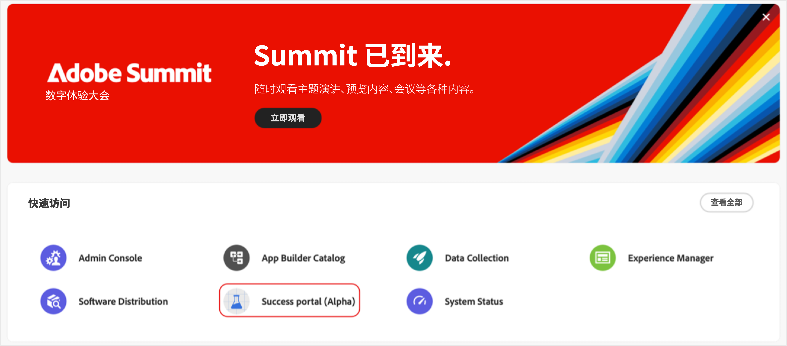
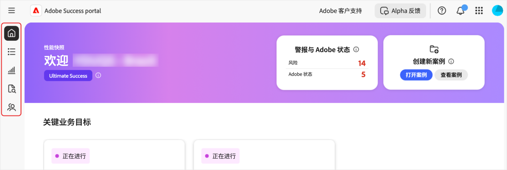
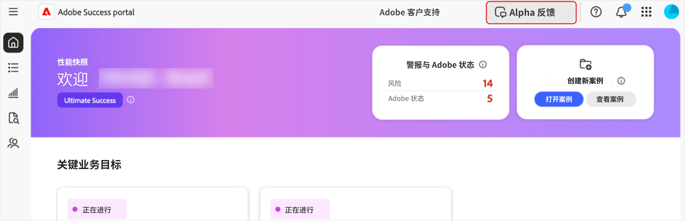

# 访问[!DNL Adobe Success]门户

本指南介绍如何登录到[!DNL Adobe Success]门户并在遇到访问问题时获得帮助。

您将会收到&#x200B;**[!UICONTROL 成功]**&#x200B;门户团队确认您访问的通知。 此消息将包含登录详细信息。

1. 转到https://experience.adobe.com/ 。
1. 使用您的Adobe ID登录。
1. 选择[!DNL Adobe Success]门户(Alpha)图标。

   

1. 登录后，您将看到五个选项卡：

   

   * 主页
   * **[!UICONTROL 行动计划]**
   * **[!UICONTROL 值跟踪器]**
   * **[!UICONTROL 支持和见解]**
   * **[!UICONTROL 支持参与计划]**

## 故障排除和支持

如果您在访问门户或其功能时遇到问题，请使用[Alpha团队渠道](https://teams.microsoft.com/l/channel/19:h-GcuAZs9uF05rervqTdx2U27ohYINuRUIfbMte9B-U1@thread.tacv2/General?groupId=02b87789-3475-47e4-94c1-0981f63ae89f&tenantId=fa7b1b5a-7b34-4387-94ae-d2c178decee1)联系我们的团队。   

您可以使用门户上的&#x200B;**[!UICONTROL Alpha反馈]**&#x200B;按钮提交反馈。

>[!NOTE]
>
>反馈工具不是专门的支持渠道。 它不适用于紧急登录问题。

