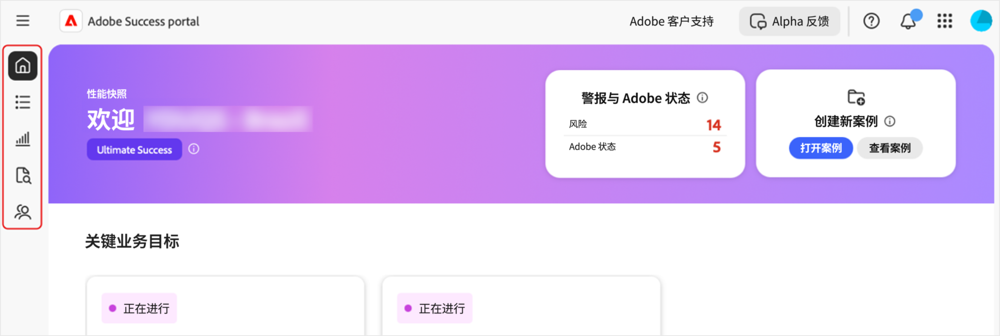
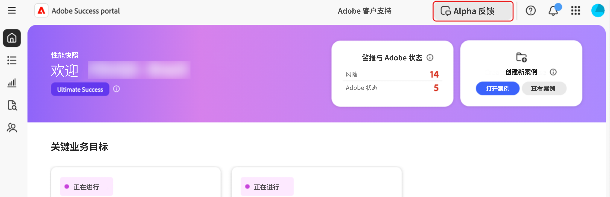

# 访问 [!DNL Adobe Success] 门户

本指南介绍如何登录 [!DNL Adobe Success] 门户，并在遇到访问问题时如何获得帮助。

您将收到来自 **[!UICONTROL Success]** 门户团队的通知，确认您的访问权限。 该消息将包含详细登录信息。

1. 前往 [https://experience.adobe.com/](https://experience.adobe.com/)。
1. 使用您的 Adobe ID 登录。
1. 选择 **[!UICONTROL Success 门户 (Alpha)]** 图标。

   ")

1. 登录后，您会看到五个选项卡：

   

   * 主页
   * **[!UICONTROL 行动计划]**
   * **[!UICONTROL 价值跟踪器]**
   * **[!UICONTROL 支持与洞察]**
   * **[!UICONTROL 支持参与计划]**

## 疑难解答和支持

如果您在访问门户或其功能时遇到问题，请使用 [Alpha Teams 频道](https://teams.microsoft.com/l/channel/19:h-GcuAZs9uF05rervqTdx2U27ohYINuRUIfbMte9B-U1@thread.tacv2/General?groupId=02b87789-3475-47e4-94c1-0981f63ae89f&tenantId=fa7b1b5a-7b34-4387-94ae-d2c178decee1)联系我们的团队。   

您可以使用门户上的 **[!UICONTROL Alpha 反馈]**&#x200B;按钮提交反馈。

>[!NOTE]
>
>反馈工具不是专门用于支持的渠道。 它不适合用于紧急的登录问题。

