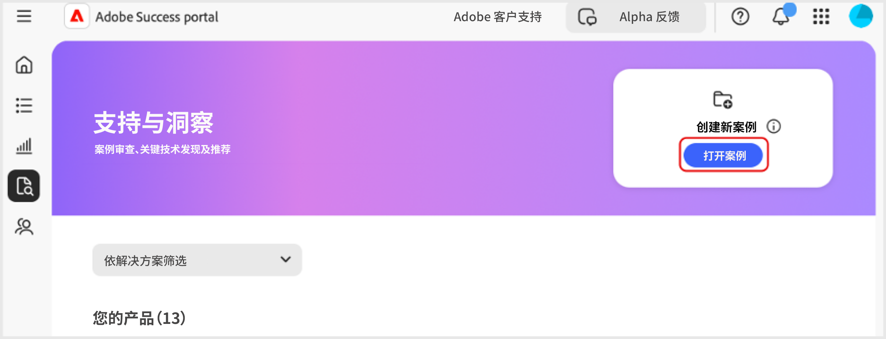

# 在 [!DNL Adobe Success] 门户中创建和管理案例

本指南介绍如何在 [!DNL Adobe Success] 门户中创建、查看和下载案例报告。

## 打开案例

您可以从“主页”选项卡或&#x200B;**[!UICONTROL 支持与洞察]**&#x200B;选项卡打开一个案例。

如要从“主页”选项卡访问&#x200B;**[!UICONTROL 打开案例]**&#x200B;页面：

1. 前往“主页”选项卡。
1. 选择&#x200B;**[!UICONTROL 打开案例]**。

   Adobe成功门户的“新建案例”部分中的

1. 填写必填字段：
   1. **[!UICONTROL 选择一个产品]**。
   1. **[!UICONTROL 案例标题]**。
   1. **[!UICONTROL 案例描述]**。
1. 选择&#x200B;**[!UICONTROL 提交案例]**。

   在Adobe成功门户的支持票证表单底部

如要从&#x200B;**[!UICONTROL 支持与洞察]**&#x200B;选项卡访问&#x200B;**[!UICONTROL 打开案例]**&#x200B;页面。

1. 前往&#x200B;**[!UICONTROL 支持与洞察]**&#x200B;选项卡。
1. 选择&#x200B;**[!UICONTROL 打开案例]**。

   Adobe成功门户的“新建案例”部分中的

按照与上述相同的步骤完成并提交案例。

## 查看案例

您可以从“主页”选项卡或&#x200B;**[!UICONTROL 支持与洞察]**&#x200B;选项卡查看一个案例。

要从“主页”选项卡访问&#x200B;**[!UICONTROL 查看案例]**&#x200B;页面：

1. 前往“主页”选项卡。
1. 选择&#x200B;**[!UICONTROL 查看案例]**。

   在Adobe成功门户的新增案例部分中

1. 选择您要查看的产品卡，然后选择&#x200B;**[!UICONTROL 未结案例]**&#x200B;或&#x200B;**[!UICONTROL 已关闭案例]**。

   >[!NOTE]
   >
   >您还可以选择&#x200B;**[!UICONTROL 支持与洞察]**&#x200B;选项卡，快速访问带有&#x200B;**[!UICONTROL 未结案例]**&#x200B;或&#x200B;**[!UICONTROL 已关闭案例]**&#x200B;链接的产品卡。

   在AEM Cloud Service的支持和见解部分中的

1. 点击&#x200B;**[!UICONTROL 案例编号]**，查看案例详细信息。

   

## 下载案例报告

下载 PDF 案例报告：

1. 导航到“主页”选项卡。
1. 选择&#x200B;**[!UICONTROL 查看案例]**。

   在Adobe成功门户的新增案例部分中

1. 选择您要查看的产品卡，然后选择&#x200B;**[!UICONTROL 未结案例]**&#x200B;或&#x200B;**[!UICONTROL 已关闭案例]**。

   >[!NOTE]
   >
   >您还可以选择&#x200B;**[!UICONTROL 支持与洞察]**&#x200B;选项卡，快速访问带有&#x200B;**[!UICONTROL 未结案例]**&#x200B;或&#x200B;**[!UICONTROL 已关闭案例]**&#x200B;链接的产品卡。

   在AEM Cloud Service的支持和见解部分中的

1. 在[产品] - 支持案例页面上，勾选要下载的案例旁边的复选框，然后选择&#x200B;**[!UICONTROL 下载案例]**。

   Adobe成功门户的“案例管理”部分中的
