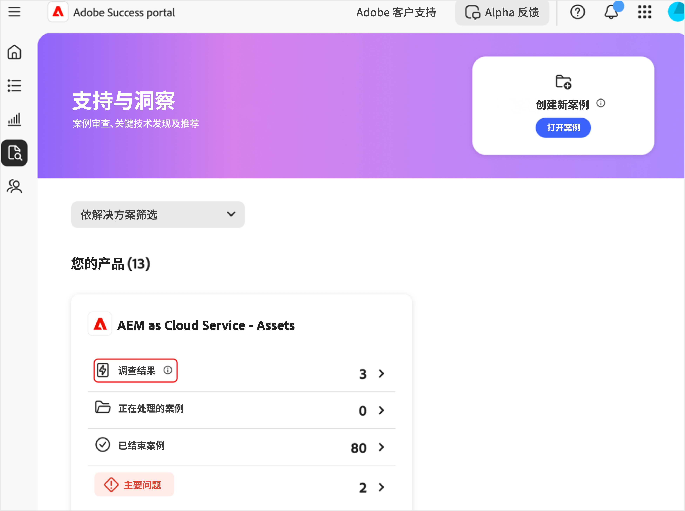
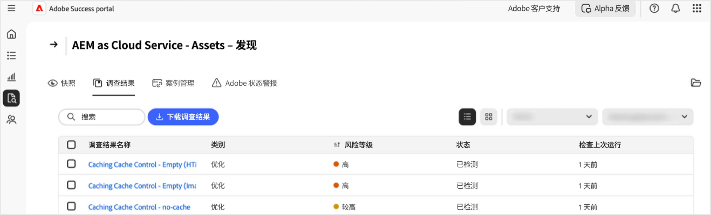
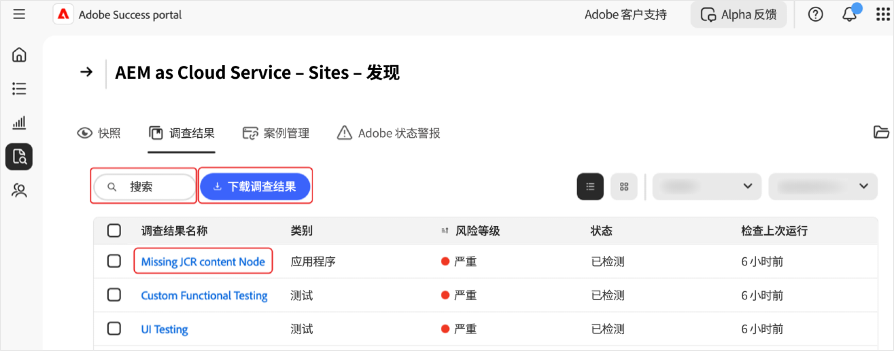
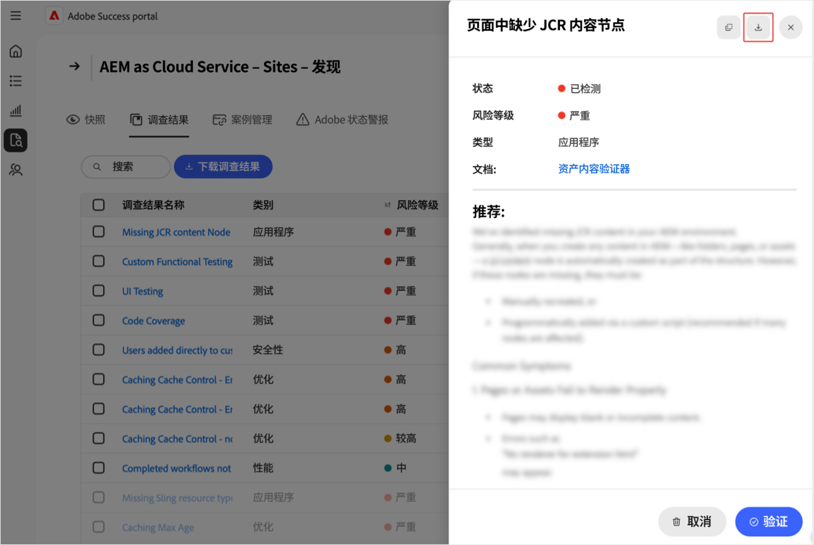
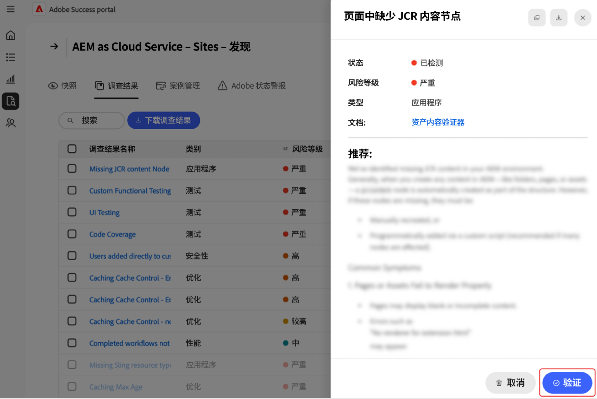

# 在[!DNL Adobe Success]门户中管理调查结果

本指南介绍如何访问、解释和处理[!DNL Adobe Success]门户中的发现结果，以帮助您主动管理产品性能、安全性和功能风险。

[!DNL Adobe Success]门户&#x200B;**[!UICONTROL 调查结果]**&#x200B;页面显示在您的Adobe产品实例中检测到的问题或风险。 调查结果包括性能、安全性和功能问题，以及它们的状态和风险级别。 监视此页面有助于您在问题影响环境之前尽早解决这些问题。

**有哪些发现？**

调查结果是[!DNL Adobe Success]门户中显示的支持分析警报。 它们会突出显示您的Adobe产品设置中的潜在问题，例如性能降低、安全风险或配置不正确。 这些警报基于从API、[!DNL New Relic]和[!DNL Splunk]等工具收集的遥测数据。

**如何创建调查结果？**

Adobe团队会定期研究最常见的支持问题和趋势。 他们根据见解向系统添加新检查。 [!DNL Adobe Success]门户每天扫描一次产品数据以检测各种问题，例如配置错误、作业停滞或可能导致系统停机的任何问题。 如果某项检查发现某些内容超出安全范围(如Adobe的产品和支持团队所定义)，则会显示为查找结果。

**为什么发现很重要**

定期审查发现有助于在问题影响您的系统或客户之前及早发现问题。 这种主动预防性的做法提高了系统稳定性，减少了停机时间，并支持最佳实践。

**如何修复调查结果**

每个发现结果都包括有关如何解决问题的建议和清晰说明，以及相关文档的链接（如果可用）。 将这些发现与您的IT、工程团队或Adobe合作伙伴分享，并一起解决这些问题。 及早解决这些问题有助于防止出现更大的问题，并保持您的系统平稳运行。

## 访问调查结果

要查看产品的分析，请执行以下操作：

1. 导航到&#x200B;**[!UICONTROL 支持和见解]**。
1. 选择相关的产品卡。 选择&#x200B;**[!UICONTROL 调查结果]**&#x200B;选项卡。

   

1. 您将看到选定产品的所有查找结果的列表。

   

1. 从这里，您可以：

   

   * 搜索特定条目。
   * 通过选择&#x200B;**[!UICONTROL 下载发现]**&#x200B;导出发现结果列表。 要导出一个发现结果的报表，请选中&#x200B;**[!UICONTROL 发现结果名称]**&#x200B;列下的相关发现结果旁边的复选框。 如果不选择查找结果，则PDF默认包含所有查找结果的列表。
   * 通过选择&#x200B;**[!UICONTROL 查找结果名称]**&#x200B;下的查找结果，查看有关查找结果的详细信息，包括推荐的解决方法。 “查找结果详细资料”页显示选定的查找结果，其中包括附加上下文和建议案。 要查看此报表，请选择下载箭头。

     

## 操作调查结果

执行以下步骤以验证每个调查结果是否仍然适用或可以忽略。

>[!NOTE]：
>
>对实例运行标准检查。 如果检查未发现实例中存在问题，则状态为&#x200B;**[!UICONTROL 未检测到]**。

1. 导航到&#x200B;**[!UICONTROL 支持和见解]**。
1. 选择相关的产品卡。
1. 打开&#x200B;**[!UICONTROL 调查结果]**&#x200B;选项卡。 您会看到所选产品的所有调查结果。
1. 在&#x200B;**[!UICONTROL 查找名称]**&#x200B;下选择一个条目。 在“查找结果详细信息”页上，您可以：
   * 选择&#x200B;**[!UICONTROL 验证]**&#x200B;以检查问题是否仍然存在（**[!UICONTROL 验证]**&#x200B;按钮设计为确认问题已得到解决）：

   

   * 如果问题仍然存在，则显示以下消息：*[!UICONTROL 验证完成。 仍然检测到发现]*。 使用“查找结果详细资料”页上的信息和建议案进行调查和解决。
   * 如果问题不再存在，则会显示以下消息：*[!UICONTROL 验证完成。 不再检测到查找结果]*。 当不再检测到该发现时，该发现将灰显，并且状态更改为&#x200B;**[!UICONTROL 未检测到]**。 具有&#x200B;**[!UICONTROL 未检测到]**&#x200B;状态的查找结果位于查找结果列表的底部。
   * 如果问题不适用或不与您相关，您可以通过选择&#x200B;**[!UICONTROL 消除]**&#x200B;来消除它。 当调查结果被取消时，调查结果灰显，状态更改为&#x200B;**[!UICONTROL 已取消]**。  具有&#x200B;**[!UICONTROL 已取消]**&#x200B;状态的发现位于发现结果列表的底部。

## 了解调查结果

* **[!UICONTROL 查找名称]** — 选择，查看详细见解和建议的解决步骤。
* **[!UICONTROL 类型]** — 分类为&#x200B;*功能*、*性能*&#x200B;和&#x200B;*安全性*。
* **[!UICONTROL 风险级别]** — 严重性指示器，带有视觉指示器。
* **[!UICONTROL 状态]** — 结果的当前状态（例如，*检测到*，*未检测到*，*已取消*）。
* **[!UICONTROL Check Last Run]** — 上次更新查找结果的检查的时间戳。

## 最佳实践

**[!UICONTROL 调查结果]**&#x200B;页面列出了具有以下风险级别的推荐：**[!UICONTROL 高]**、**[!UICONTROL 已提升]**&#x200B;和&#x200B;**[!UICONTROL Medium]**。 **[!UICONTROL 高]**&#x200B;是关键的，**[!UICONTROL 提升的]**&#x200B;是紧急的，而&#x200B;**[!UICONTROL Medium]**&#x200B;是非关键的。 要维护站点运行状况和性能，请执行以下操作：

* 及时解决&#x200B;**[!UICONTROL 高风险]**&#x200B;问题，因为它们构成严重威胁。
* 尽快解决&#x200B;**[!UICONTROL 提升的]**&#x200B;风险问题以避免提升。
* 定期监控&#x200B;**[!UICONTROL Medium]**&#x200B;风险发现并根据需要采取行动。

