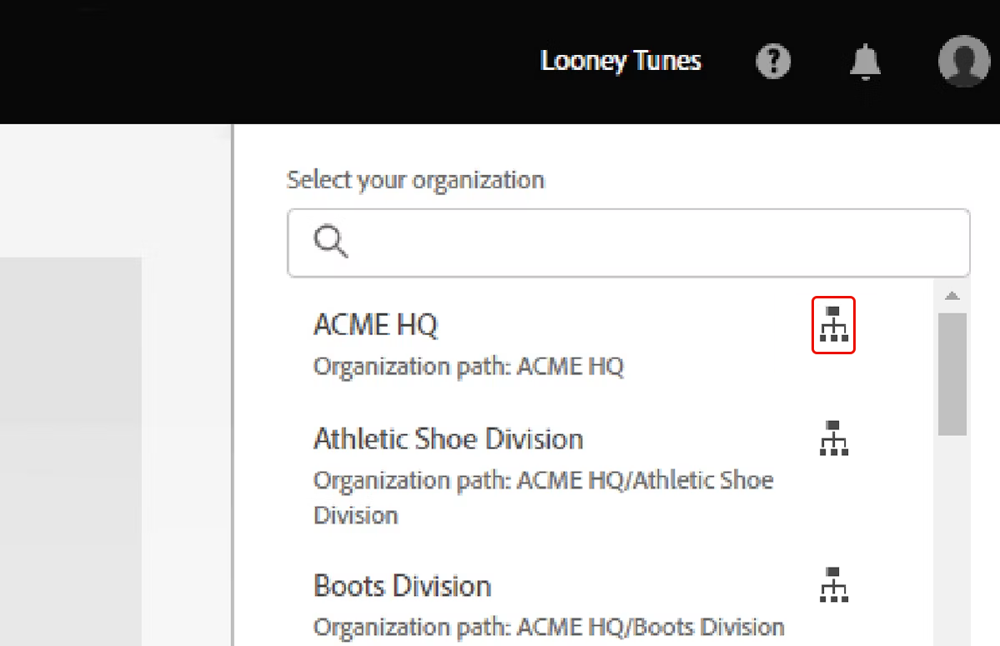

# Adobe Admin Console概述

适用于企业和团队。

Adobe Admin Console是一个中央位置，用于管理整个组织的Adobe授权。 您可以使用它来管理您的许可证、用户和付款。 转到此处[登录到Admin Console](https://adminconsole.adobe.com)。 若要了解详细信息，请参阅以下[视频](https://helpx.adobe.com/enterprise/using/admin-console.html)。

Admin Console上的每个选项卡都允许您执行各种任务。 选择链接的选项卡名称（每个项目的第一个字）以跳转到该部分。

- [!UICONTROL 概述](#overview)：查看已购买的许可证和快速操作摘要，以设置您的组织。

- [!UICONTROL 产品](#products)：将许可证分配给用户和组。 作为企业客户，您可以管理产品配置文件。

- [!UICONTROL 用户](#users)：创建、更新和移除用户帐户，这将使最终用户有权使用Adobe产品和服务。

- [!UICONTROL 包](#packages)：下载预配置的包，或为您计划部署的桌面应用创建包。

- [!UICONTROL 帐户](#account)：管理贵组织与Adobe的合同和协议。

- [!UICONTROL 存储](#storage)：管理单个用户文件夹和共享文件夹，并查看用户使用的存储配额。

- [!UICONTROL 分析](#insights)：查看、创建和下载许可证分配报告，并跟踪在Admin Console中所做的更改。

- [!UICONTROL 设置](#settings)：声明域、限制对共享功能的访问、为最终用户添加注释、设置密码保护级别。

如果您无法登录到Admin Console，请参阅[解决Adobe帐户登录问题](https://helpx.adobe.com/manage-account/kb/account-password-sign-help.html)。

## [!UICONTROL 概述] {#overview}

“**[!UICONTROL 概述]**”选项卡可以有效地显示有关产品许可证的大量信息。 它显示计划中的许可证状态 — 在总可用许可证中分配的许可证数量。 还有一些快速链接可用于添加用户和管理员。

## 选择您的组织

一个管理员可以属于多个组织。 如果一家公司有多个作为单独组织存在的子公司，或者每个子公司都有单独的许可协议，则可以为所有子公司分配相同的管理员。

如果您是多个组织的管理员，则可以使用组织选择器在各组织之间切换。 所选组织会在组织名称旁边显示一个绿色复选标记。

如果组织是Global Admin Console的一部分，则组织名称旁边会显示一个层次结构图标。 您还可以查看组织的路径，并可确定组织在层次结构中的位置。 例如，在屏幕截图中，管理员是组织B的成员，该组织的Global Admin Console路径为A > B，其中B是组织A的子级。

如果您的组织结构复杂，拥有多个Admin Console，或者您要将主Admin Console拆分为多个控制台，您可以[采用Global Admin Console](https://experienceleague.adobe.com/en/docs/support-resources/adobe-support-tools-guide/adobe-admin-console/adopt-global-administration)。 例如，跨国公司、教育联合会、大型学区和大型政府机构。 Global Admin Console将现有的Admin Console嵌套到一个层次结构中（如组织结构图），以在分布式企业中提供透明度。

## [!UICONTROL 产品] {#products}

谁可以查看此选项卡：系统管理员、产品管理员和产品配置文件管理员。

**企业**

**[!UICONTROL Admin Console]**&#x200B;中的[产品](https://adminconsole.adobe.com)页面提供了用于管理产品和产品配置文件的选项。 通过产品配置文件，可启用计划中可用的所有Adobe应用程序和服务或其子集，并自定义与给定产品或计划关联的设置。 然后，您可以将管理员（称为产品管理员）分配给产品配置文件。 这些管理员将最终用户添加到他们管理的产品配置文件。

有关更多信息，请参阅：

- [管理产品](https://helpx.adobe.com/cn/enterprise/using/manage-products.html)
- [管理产品配置文件](https://experienceleague.adobe.com/en/docs/support-resources/adobe-support-tools-guide/adobe-admin-console/manage-product-profiles)

**团队**

通过&#x200B;**[!UICONTROL Admin Console]**&#x200B;中的[产品](https://adminconsole.adobe.com)页面，可将产品许可证分配给用户。 要将产品许可证分配给用户或组，请在&#x200B;**[!UICONTROL 产品]**&#x200B;页面上选择所需的产品，然后单击&#x200B;**[!UICONTROL 添加用户]**。

输入用户的名称或电子邮件地址。 您可以通过指定有效的电子邮件地址并在屏幕上填写信息来搜索现有用户或添加用户。 单击 **[!UICONTROL Save]**。将向用户或组发送一封电子邮件，确认对应用程序的访问权限。

有关更多信息，请参阅：

- [分配或取消分配许可证](https://helpx.adobe.com/enterprise/using/assign-licenses-to-teams-users.html)
- [添加或删除产品或许可证](https://helpx.adobe.com/enterprise/using/add-products-and-licenses.html)

## [!UICONTROL 用户] {#users}

通过&#x200B;**[!UICONTROL Admin Console]**&#x200B;中的[用户](https://adminconsole.adobe.com)页面，您可以创建、搜索、更新和移除用户帐户。 这些用户帐户授权贵组织中的最终用户使用Adobe产品和服务。 您还可以使用批量编辑工作流添加用户或修改用户详细信息和许可证分配。

有关更多信息，请参阅：

- [管理用户](https://helpx.adobe.com/cn/enterprise/using/users.html)
- [管理用户组](https://helpx.adobe.com/cn/enterprise/using/user-groups.html)

## [!UICONTROL 帐户] {#account}

谁可以查看此标签：系统管理员和合同管理员。

系统和合同管理员可以通过Admin Console中的&#x200B;**[!UICONTROL 帐户]**&#x200B;选项卡管理其组织的Adobe合同。

根据您的计划（Enterprise、VIP、VIP Marketplace或团队），您可以：

- 查看关键合同详细信息，如合同ID、状态、周年纪念/结束日期以及应用程序和许可证。
- 更改合同的显示名称，以便于识别。
- 添加或删除合同管理员。
- 管理付款详细信息、发票和续订。
- 查看您的Adobe客户经理的联系详细信息。

了解详情： [管理您的帐户](https://helpx.adobe.com/enterprise/using/accounts.html)。

## [!UICONTROL 洞察] {#insights}

可以查看此选项卡的用户：系统管理员。

### [!UICONTROL 审核日志]

**[!UICONTROL 审核日志]**&#x200B;有助于确保持续合规、防止任何不适当的系统访问以及审核组织内的可疑行为。

作为系统管理员，您可以完全查看[Admin Console](https://adminconsole.adobe.com/)中所做的更改。 您可以根据操作类型、操作发生时间和操作发起者来搜索审核日志。

然后，查看和下载这些报告以进行进一步分析。 了解详情： [使用审核日志跟踪用户分配和事件](https://helpx.adobe.com/enterprise/using/audit-logs.html)。

### [!UICONTROL 任务报告]

使用许可证分配报表，您可以跟踪组织的许可证分配数据并计划用户的许可证部署。 许可证分配数据仅支持根据企业定期许可协议购买的Creative Cloud和Document Cloud产品的指定用户许可证。

了解详情：[企业产品的许可证分配报告](https://helpx.adobe.com/enterprise/using/assignment-reports.html)。

## [!UICONTROL 存储] {#storage}

谁可以查看此选项卡：系统管理员和存储管理员（仅适用于迁移到[池化存储模型](https://helpx.adobe.com/enterprise/using/manage-adobe-storage.html)的客户）。

**[!UICONTROL Admin Console]**&#x200B;中的[存储页面](https://adminconsole.adobe.com)允许您查看整个Creative Cloud应用程序中的存储。 存储配额对最终用户而言是灵活的，最高可达组织购买的存储量。

您还可以查看单个用户使用了多少配额，以及所有用户使用的总配额。

了解详情： [管理Adobe存储](https://helpx.adobe.com/enterprise/using/manage-adobe-storage.html)。

## [!UICONTROL 包] {#packages}

谁可以查看此选项卡：系统管理员和部署管理员。

**[!UICONTROL Admin Console]**&#x200B;中的[包](https://adminconsole.adobe.com)页面提供了以下功能。 当您计划向组织中的最终用户部署桌面应用程序时，请使用它们。

- 使用[Adobe模板](https://helpx.adobe.com/enterprise/using/package-templates.html)下载预配置的包。
- 使用您希望最终用户拥有的配置和应用程序创建自定义的[指定用户许可](https://helpx.adobe.com/enterprise/using/create-nul-packages.html)或[共享设备](https://helpx.adobe.com/enterprise/using/create-sdl-packages.html)许可（适用于教育机构）打包程序。
- 启用电子邮件通知，这样您就可以在新产品版本可用时收到通知。
- 查看您或组织中的其他管理员之前创建的资源包。 此外，还可以查看特定包的详细信息，并跟踪包中应用程序的可用更新。
- 下载IT工具，如[远程更新管理器](https://helpx.adobe.com/enterprise/using/using-remote-update-manager.html)和[Adobe更新服务器安装工具](https://helpx.adobe.com/enterprise/using/update-server-setup-tool.html)。
- 从ZXP文件容器格式下载Adobe Extension Manager命令行工具以[安装扩展和插件](https://helpx.adobe.com/enterprise/using/manage-extensions.html)。

有关详细信息，请参阅[通过Admin Console打包应用程序](https://helpx.adobe.com/enterprise/using/package-apps-admin-console.html)。

## [!UICONTROL 设置] {#settings}

谁可以查看此选项卡：系统管理员和存储管理员。

存储管理员只能访问[资源设置](https://helpx.adobe.com/enterprise/using/asset-settings.html)和[内容日志](https://helpx.adobe.com/enterprise/using/content-logs.html)。 系统管理员可以根据其计划查看或修改设置。

>[!NOTE]
>
> Adobe不提供针对顶级管理员的本机功能，以便他们能够将当前Admin Console设置与Adobe推荐的安全默认值进行比较。 管理员可以参考Adobe推荐的配置指南，并使用其组织的身份提供程序、端点管理工具和内部审计流程来验证合规性。

## 隐私和安全联系人

如果发生涉及我们软件解决方案的安全事件，我们会向相应的合规管理人员发送通知。 作为系统管理员，为了帮助确保及时通知，您必须指定安全、数据保护和合规性官员的身份。 有关详细信息，请参阅[隐私和安全联系人](https://helpx.adobe.com/enterprise/using/security-contacts.html)。

## [!UICONTROL 控制台设置]

使用[!UICONTROL 控制台设置](https://helpx.adobe.com/enterprise/using/console-settings.html)，您可以添加自定义注释，以便最终用户在遇到问题或需要支持时与其沟通以获得帮助。

为您的组织选择默认电子邮件语言，以接收有关帐户状态（如订阅更改或信用卡到期）的电子邮件。 如果您直接从Adobe购买团队成员资格，则可以从&#x200B;**[!UICONTROL 控制台设置]**&#x200B;更改团队名称。

## [!UICONTROL 内容日志]

作为管理员，您可以下载有关最终用户如何使用公司资产（如文件夹、文件和库）的详细报告。 这些报告称为[!UICONTROL 内容日志](https://helpx.adobe.com/enterprise/using/content-logs.html)。

## 域实施

系统管理员可以限制组织拥有的域，以防止用户创建和使用个人Adobe ID帐户。 这限制了个人数据的使用，增强了安全性，并且仅允许在组织用户之间共享资产。

了解详情： [受限身份验证的域实施](https://helpx.adobe.com/enterprise/using/restricting-domains.html)。

## 身份标识

[身份类型](https://helpx.adobe.com/cn/enterprise/using/identity.html)允许组织对用户的帐户和数据拥有不同级别的控制权。 它会影响您的组织存储和共享资产的方式。

## [!UICONTROL 资源设置]

[资产设置](https://helpx.adobe.com/enterprise/using/asset-settings.html)允许组织控制其员工如何在组织外共享其资产。 资源设置将与其他组织策略实施系统（Adobe未提供）一起使用，以确保仅与适当的外部个人和组织共享资源。

## 身份验证设置

[身份验证设置](https://helpx.adobe.com/enterprise/using/authentication-settings.html)支持多个密码保护级别和策略以确保安全性和安全性。 您可以指定密码保护级别，以应用到组织中的所有用户。

## 加密设置

[加密设置](https://helpx.adobe.com/enterprise/using/encryption.html)为额外的控制层和安全性层生成专用加密密钥。

## 项目策略

作为系统管理员，您可以控制谁有权创建和管理组织中的项目。 默认情况下，添加到Admin Console的所有用户都可以创建和管理项目。

了解更多： [项目策略](https://helpx.adobe.com/enterprise/using/projects-in-business-storage.html#project-policies)。

## 支持

要联系Adobe客户关怀部门，请导航到[Admin Console](https://adminconsole.adobe.com/)中的“支持”页面，该页面允许您执行以下操作：

- 管理您的支持案例（仅限企业）
- 创建案例（仅限Enterprise）
- 与Adobe客户关怀代表联系
- 安排专家讲座
- 浏览热门帮助主题和论坛

若要了解有关支持选项的更多信息，请参阅[支持和专家会议](https://helpx.adobe.com/enterprise/using/support-and-expert-services.html)。
