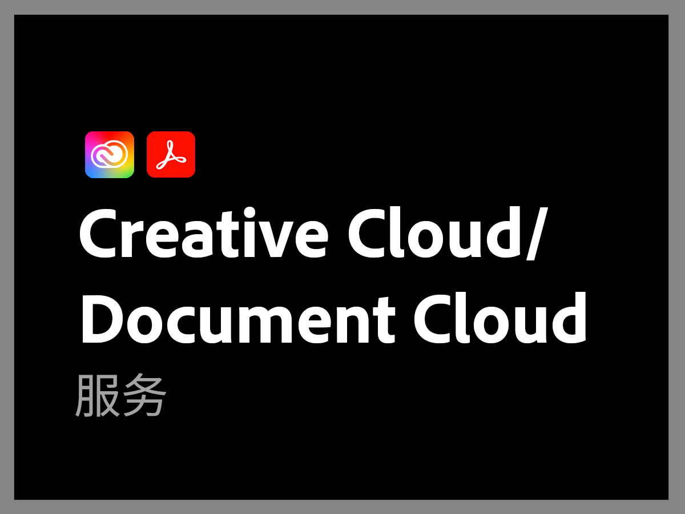

# 先前的 Adobe 支持计划概述

>[!NOTE]
>
>此计划是指 2022 年 6 月 16 日之前的 Adobe 支持计划。 有关当前支持计划，请参阅 [Adobe 支持产品概述](overview.md)。

Adobe 支持组织致力于助您成功。所有订阅都包含某个级别的支持，可让您轻松联系我们娴熟精湛的技术人员以获得技术援助。

为了满足更全面的需求，我们提供 Adobe 支持服务，其中包括联系指定的支持专业人员以及用于主动指导和服务评价的会议。无论您的支持需求有多么复杂，Adobe 都能提供帮助您从 Adobe 解决方案取得佳绩和创造价值所需的技术和运营专业知识。

<table style="table-layout:fixed">
<tr>
  <td>
    
    

    <a href="dx-overview.md"><strong>Experience Cloud 支持</strong></a>
    

    
Experience Cloud 和 Experience Platform 产品的支持选项

     
  </td>
  <td>
    
    

    <a href="dme-overview.md"><strong>Creative Cloud 企业和文档支持</strong></a>
    

    
Creative Cloud 和 Document Cloud 产品的支持选项

     
  </td>
</tr>
</table>
